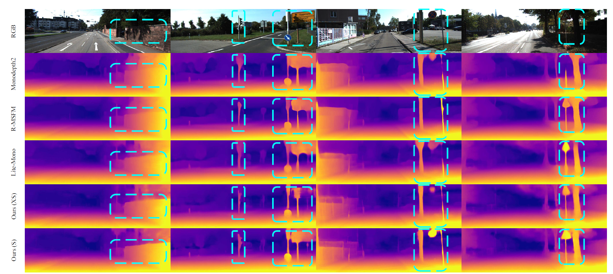

# Eco-Depth

This work is an early version of our submission paper, "Self-supervised monocular depth estimation with
channel-wise attention mechanism: An economical approach"

We will update the full version after the article is accepted, please consider citing it if you think it is a useful work.

## Results on KITTI dataset

## Results on DDAD dataset

## Visualization results on KITTI dataset

## Training & Testing:
The main framework of this project is based on Monodepth2. You can use the code of this project to replace the corresponding positions of Monodepth2 for training and testing.

#### Acknowledgement
 - Thank the authors for their superior works: [monodepth2](https://github.com/nianticlabs/monodepth2), [Lite-Mono](https://github.com/noahzn/Lite-Mono)
 